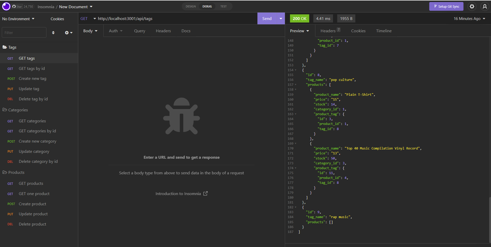

# E-Commerce Back End

## Table of Contents
* [Project description](#description)
* [How to install the app](#installation)
* [How to use the app](#usage)
* [License](#license)

# Project description
Based on the starter code, build the back end for an e-commerce site by configuring a working Express.js API to use Sequelize to interact with a MySQL database.

# How to install the app

* Run "npm install"
* Login to mysql by enter "mysql -u root -p" in the cmd environment
* Then source the schema.sql
* Quit mysql and get back to the file folder
* Run "npm run seed"
* Run "npm start"

# How to use the app
Users can view, add, edit or delete data via Insomnia, by using the command like "GET, POST, PULL and DELETE.

### A [walkthrough video](https://youtu.be/fB1M9KO1qos) is posted to demonstrate the functionality of the app and how to use it.

# License
MIT